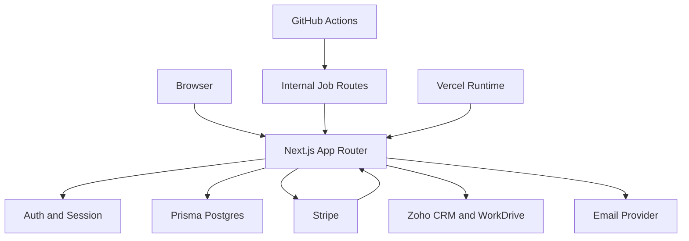

# ZoKorp Platform Threat Model

## Executive summary

ZoKorp Platform is a public SaaS-style Next.js application with authenticated account/admin surfaces, paid Stripe flows, file-backed diagnostic tools, and secret-authenticated internal job routes. The highest-risk themes in the current repo are privileged server-side authorization, integrity of internal scheduled endpoints and webhook flows, upload/parsing abuse on diagnostic inputs, and data exposure through admin/export/logging paths. The codebase already has meaningful controls in these areas, but the remaining risk is driven by env/config drift, external provider dependencies, and the breadth of sensitive integrations.

## Scope and assumptions

- In scope:
  - Runtime app code in `app/`, `lib/`, `prisma/`, `scripts/production_smoke_check.mjs`
  - Scheduled-job and deployment workflows in `.github/workflows/`
  - Operator docs in `README.md`, `docs/03-environment-variables-template.md`, `docs/07-open-questions.md`
- Out of scope:
  - Provider dashboards and live config inside Vercel, GitHub, Stripe, Zoho, SMTP/Resend
  - Network edge controls not visible in repo
  - Human policy/legal decisions such as retention approval, SLAs, compliance claims, and live billing posture
- Assumptions:
  - The app is internet-exposed and deployed on Vercel or an equivalent managed Next.js runtime, based on `README.md` and `docs/07-open-questions.md`.
  - TLS termination, managed database hardening, and platform firewalling are handled outside this repo and must be verified separately.
  - ZoKorp is single-tenant at the operator level, but multiple customer accounts and submissions coexist in one application database.
  - Internal scheduled routes are triggered by GitHub Actions using shared secrets from workflow environment configuration.

Open questions that would materially change risk ranking:

- Are `ARCH_REVIEW_WORKER_SECRET`, `ARCH_REVIEW_FOLLOWUP_SECRET`, `ZOHO_SYNC_SECRET`, `STRIPE_WEBHOOK_SECRET`, and auth/email secrets all set distinctly in production?
- What runtime headers and caching behavior are actually present at the edge in production?
- Is there any live admin or support workflow outside the app that can mutate entitlements, exports, or user roles?

## System model

### Primary components

- Browser/UI layer: public pages, account pages, admin pages, and tool pages in `app/` accept user input and submit to App Router route handlers.
- Auth/session layer: credentials auth, business-email enforcement, role sync, and session invalidation are implemented in `lib/auth.ts`, `lib/admin-access.ts`, and `lib/auth-secret.ts`.
- Next.js server/API layer: privileged actions live in route handlers under `app/api/`, including billing, uploads, auth, diagnostics, and internal jobs.
- Data layer: Prisma/Postgres models for users, entitlements, leads, audit logs, and architecture jobs are defined in `prisma/schema.prisma` and accessed through `lib/db.ts`.
- Billing layer: Stripe Checkout, portal sessions, and webhook fulfillment run through `app/api/stripe/create-checkout-session/route.ts`, `app/api/stripe/create-portal-session/route.ts`, `app/api/stripe/webhook/route.ts`, and `lib/stripe.ts`.
- Diagnostic processing layer: architecture-review submissions, validator parsing, and the MLOps forecasting workspace live in `app/api/submit-architecture-review/route.ts`, `app/api/tools/zokorp-validator/route.ts`, and `app/api/tools/mlops-forecast/route.ts`.
- Integration layer: Zoho CRM/WorkDrive and email delivery are implemented in `app/api/zoho/sync-leads/route.ts`, `lib/zoho-workdrive.ts`, `lib/auth-email.ts`, and `lib/architecture-review/sender.ts`.
- Internal job triggers: GitHub Actions invoke internal routes via `.github/workflows/architecture-review-worker.yml`, `.github/workflows/architecture-followups.yml`, and `.github/workflows/zoho-sync-leads.yml`.

### Data flows and trust boundaries

- Internet browser -> Next.js routes and pages
  - Data: credentials, session cookies, diagnostic answers, file uploads, billing requests, admin actions
  - Channel: HTTPS
  - Security guarantees: NextAuth session checks, same-origin checks on state-changing routes (`lib/request-origin.ts`), zod schemas, route-level rate limits, file size/type validation
  - Validation: auth email normalization in `lib/auth.ts`, free-tool verification in `lib/free-tool-access.ts`, upload validation in `lib/security.ts` and `app/api/submit-architecture-review/route.ts`
- Next.js server -> Prisma/Postgres
  - Data: user records, password metadata, entitlements, audit logs, lead logs, tool submissions
  - Channel: Prisma/Postgres connection via `DATABASE_URL`
  - Security guarantees: server-side only access through `lib/db.ts`, transactional entitlement updates in `lib/entitlements.ts`, unique constraints and relations in `prisma/schema.prisma`
  - Validation: Prisma schema and route/business logic
- Next.js server -> Stripe APIs
  - Data: customer IDs, checkout sessions, billing portal sessions, product/price IDs
  - Channel: HTTPS API calls via `lib/stripe.ts`
  - Security guarantees: authenticated user ownership checks in checkout/portal routes, allowlisted price IDs in `lib/stripe-price-id.ts`
  - Validation: Stripe secret env presence, DB product/price lookup, same-origin checks on billing routes
- Stripe -> webhook route
  - Data: signed event payloads for checkout completion and subscription lifecycle
  - Channel: HTTPS POST with `stripe-signature`
  - Security guarantees: signature verification in `app/api/stripe/webhook/route.ts`, duplicate-delivery handling via `checkoutFulfillment`
  - Validation: event-type branching, metadata lookup, transactional entitlement updates
- GitHub Actions -> internal job routes
  - Data: secret-bearing HTTP triggers for worker, follow-ups, and Zoho sync
  - Channel: HTTPS POST
  - Security guarantees: timing-safe secret comparison and no-store responses in `app/api/architecture-review/worker/route.ts`, `app/api/architecture-review/followups/route.ts`, and `app/api/zoho/sync-leads/route.ts`
  - Validation: explicit POST handling, secret checks, failure audit logging, generic caller-visible error bodies
- Next.js server -> Zoho CRM / WorkDrive / email providers
  - Data: lead/contact metadata, archived diagrams, verification and follow-up emails
  - Channel: HTTPS APIs and SMTP/Resend
  - Security guarantees: secrets loaded server-side only, request timeouts via `lib/http.ts`, archive/token refresh logic in `lib/zoho-workdrive.ts`
  - Validation: provider response handling, retry/token refresh branches, limited body snippet handling on WorkDrive errors

#### Diagram

## Assets and security objectives

| Asset | Why it matters | Security objective (C/I/A) |
| --- | --- | --- |
| Auth secrets and password state | Session forgery or password-flow compromise leads to account takeover and admin exposure | C / I |
| User emails and verification state | Core identity for auth, billing, lead handling, and free-tool gating | C / I |
| Lead and diagnostic submissions | Contain business architecture data, contact information, and follow-up state | C / I |
| Billing identifiers and entitlements | Incorrect mutation can unlock paid tools or break customer access | I / A |
| Uploaded diagrams, PDFs, and XLSX files | Untrusted binary input is the main parser/resource-abuse surface | C / I / A |
| Audit logs and operational job outcomes | Needed for operator investigation, billing traceability, and incident response | I / A |
| Provider credentials for Stripe, Zoho, SMTP/Resend, and GitHub Actions | Compromise enables cross-system abuse and data exposure | C / I |

## Attacker model

### Capabilities

- Unauthenticated remote attackers can reach all public pages and any public API route that lacks an auth or secret boundary.
- Authenticated low-privilege users can attempt cross-account access, entitlement abuse, or admin privilege escalation.
- Attackers can submit malformed diagnostic files and oversized or adversarial payloads to upload/parsing endpoints.
- Attackers can probe scheduled/internal routes for weak secret validation, cached responses, or verbose failure details.
- Attackers can replay or spoof webhook traffic if signature checks or event/idempotency handling are weakened.

### Non-capabilities

- Attackers are not assumed to have direct database, Vercel, Stripe, Zoho, or GitHub dashboard access unless a secret is already compromised.
- Attackers are not assumed to bypass TLS or managed platform isolation at the network layer.
- Attackers are not assumed to have arbitrary code execution on the Next.js host from repo evidence alone.

## Entry points and attack surfaces

| Surface | How reached | Trust boundary | Notes | Evidence (repo path / symbol) |
| --- | --- | --- | --- | --- |
| Credentials auth and session issuance | Browser POST to auth endpoints | Browser -> Next.js | Password login, lockout logic, role sync, session invalidation | `lib/auth.ts`, `app/api/auth/[...nextauth]/route.ts` |
| Registration / email verification / reset | Browser POST | Browser -> Next.js -> Email | Sensitive account bootstrap and reset flow | `app/api/auth/register/route.ts`, `app/api/auth/verify-email/request/route.ts`, `app/api/auth/password/request-reset/route.ts`, `app/api/auth/password/reset/route.ts` |
| Architecture review submission route | Browser multipart POST | Browser -> Next.js -> DB / Email / Zoho | Public upload/input path with lead creation, review delivery, and archival side effects | `app/api/submit-architecture-review/route.ts` |
| Paid validator upload route | Authenticated multipart POST | Browser -> Next.js -> Parser / DB / Email | PDF/XLSX parsing plus entitlement consumption and result delivery | `app/api/tools/zokorp-validator/route.ts`, `lib/security.ts`, `lib/validator.ts` |
| MLOps forecasting upload route | Authenticated multipart POST | Browser -> Next.js -> Parser / DB | CSV/XLSX parsing plus subscription-gated forecast execution | `app/api/tools/mlops-forecast/route.ts`, `lib/mlops-forecast.ts`, `lib/workbook.ts` |
| Billing checkout and portal routes | Authenticated POST | Browser -> Next.js -> Stripe | Must remain scoped to the current user and valid prices | `app/api/stripe/create-checkout-session/route.ts`, `app/api/stripe/create-portal-session/route.ts` |
| Stripe webhook | Stripe POST | Stripe -> Next.js -> DB | Integrity-critical entitlement mutation path | `app/api/stripe/webhook/route.ts` |
| Internal scheduled routes | GitHub Actions POST with secret | GitHub Actions -> Next.js | Worker/follow-up/Zoho routes must fail closed | `app/api/architecture-review/worker/route.ts`, `app/api/architecture-review/followups/route.ts`, `app/api/zoho/sync-leads/route.ts`, `.github/workflows/*.yml` |
| Admin pages and export route | Authenticated browser access | Browser -> Next.js -> DB | High-sensitivity PII and operational data | `app/admin/*`, `app/admin/leads/export/route.ts`, `lib/admin-access.ts` |
| CSP report endpoint | Browser / CSP agent POST | Browser -> Next.js | Low-trust telemetry sink that writes audit logs | `app/api/security/csp-report/route.ts`, `lib/csp.ts` |

## Top abuse paths

1. Gain or reuse a valid session, then reach an admin or export path where UI gating exists but server-side authz is incomplete, resulting in lead or billing data exposure.
2. Trigger a state-changing internal route with a guessed, leaked, or reused secret and cause background job execution, CRM writes, or follow-up emails outside the intended scheduler.
3. Submit crafted PDF/XLSX or diagram uploads that pass superficial checks, forcing expensive parsing or unsafe downstream handling to degrade availability or expose parser bugs.
4. Replay or forge Stripe webhook-like payloads to create entitlements or mutate subscription state without corresponding payment if signature or idempotency handling regresses.
5. Abuse free-tool submission routes with many verified or compromised business-email accounts to create lead spam, drive cost, or exfiltrate result emails.
6. Exploit overly verbose internal error responses or logs to learn provider behavior, schema state, or operational weaknesses that help later attacks.
7. Abuse admin allowlist drift or stale role synchronization so a once-privileged account retains elevated access after policy changes.

## Threat model table

| Threat ID | Threat source | Prerequisites | Threat action | Impact | Impacted assets | Existing controls (evidence) | Gaps | Recommended mitigations | Detection ideas | Likelihood | Impact severity | Priority |
| --- | --- | --- | --- | --- | --- | --- | --- | --- | --- | --- | --- | --- |
| TM-01 | Authenticated user or stolen session | Valid account session | Attempt admin/export or cross-account access beyond owned resources | Lead/PII exposure and privilege escalation | Emails, lead data, audit data, entitlements | `requireUser()` / `requireAdmin()` in `lib/auth.ts`; admin allowlist sync in `lib/admin-access.ts`; server-side entitlement checks in `lib/entitlements.ts` | No single documented authz inventory yet; admin access still depends on env allowlist correctness | Continue route-by-route authz review, add negative tests for admin/export/account paths, document admin-role revocation behavior | Alert on admin-role changes, failed admin access, export usage spikes | Medium | High | High |
| TM-02 | Remote attacker or leaked CI secret holder | Internal-route secret leak, reuse, or weak verification | Invoke worker/follow-up/Zoho sync routes directly | Unauthorized job execution, CRM writes, email spam, operational abuse | Lead data, provider quotas, audit trail, availability | Timing-safe secret checks and no-store responses on internal routes; dedicated GitHub Actions callers in `.github/workflows/architecture-followups.yml` and `.github/workflows/zoho-sync-leads.yml` | Follow-up route still keeps a `ZOHO_SYNC_SECRET` compatibility fallback; live secret separation is not verified | Remove fallback after production verification, add explicit runtime readiness checks, keep failure responses generic, audit internal route runs | Alert on failed/unauthorized internal route requests and unexpected job-run frequency | Medium | High | High |
| TM-03 | Unauthenticated or authenticated submitter | Access to upload forms | Send malformed or adversarial diagrams/PDF/XLSX files | Parser/resource exhaustion, unsafe file handling, downstream processing failures | Availability, uploaded customer artifacts, parser integrity | Upload size/type checks in `lib/security.ts`; PNG/SVG validation in `app/api/submit-architecture-review/route.ts`; validator file checks in `app/api/tools/zokorp-validator/route.ts` | XLSX/PDF parsing still depends on third-party libraries; retention/deletion posture for derived artifacts is not explicit yet | Add more parser failure tests, document retention/deletion, keep raw-byte persistence minimal, monitor parser failure rates | Track repeated 4xx/5xx upload failures and parser exceptions by route | Medium | High | High |
| TM-04 | Remote attacker spoofing billing events or abusing checkout | Access to public billing routes or webhook endpoint | Forge/replay webhook or misbind checkout metadata | Incorrect entitlements, billing confusion, support burden | Entitlements, billing IDs, audit logs | Same-origin checks + auth on checkout/portal routes; signature verification and duplicate-checkout handling in `app/api/stripe/webhook/route.ts` | Production Stripe secret/webhook config is unverified from repo; no separate billing incident runbook yet | Verify live Stripe secrets/dashboard config, add more webhook failure-mode tests, document webhook incident handling | Alert on repeated webhook signature failures and duplicate fulfillment attempts | Low | High | Medium |
| TM-05 | Operator error, attacker with limited access, or compromised admin session | Admin access or log visibility | Over-expose PII via exports, admin views, or verbose logs | Privacy breach and trust damage | Emails, lead details, audit data | Admin gating in `lib/admin-access.ts`; CSV export route exists; some audit logging already in billing/auth/tool routes | No dedicated admin audit view yet; some provider integration code still builds verbose error strings for internal logs | Review export scopes and audit payloads, add retention/deletion docs, add admin-visible operational audit surfaces | Monitor export usage and large-volume admin queries | Medium | Medium | Medium |
| TM-06 | Frontend attacker exploiting XSS defense-in-depth gaps | XSS foothold or malicious third-party script | Abuse permissive script/style CSP to expand impact of frontend injection | Session abuse, UI tampering, data theft from in-session actions | Sessions, user actions, browser trust | React escaping-by-default, `frame-ancestors 'none'`, CSP builder in `lib/csp.ts` | CSP still uses `'unsafe-inline'` and dev mode uses `'unsafe-eval'`; runtime production header verification is not yet evidenced | Tighten CSP where feasible, review inline scripts and third-party loads, verify production headers at runtime | Capture CSP violations and investigate blocked script spikes | Medium | Medium | Medium |

## Mitigations and focus paths for manual review

- `lib/auth.ts`
  - Core credentials auth, lockout, admin-role sync, and session invalidation behavior.
- `lib/admin-access.ts`
  - Environment-driven admin allowlist and stale-role handling.
- `app/api/stripe/webhook/route.ts`
  - Integrity-critical entitlement mutation path with external event input.
- `app/api/stripe/create-checkout-session/route.ts`
  - User-owned billing initiation and price/product binding.
- `app/api/architecture-review/worker/route.ts`
  - Secret-authenticated internal worker trigger.
- `app/api/architecture-review/followups/route.ts`
  - Secret-authenticated follow-up sender with email side effects.
- `app/api/zoho/sync-leads/route.ts`
  - Secret-authenticated CRM sync with external write side effects.
- `app/api/submit-architecture-review/route.ts`
  - Multipart upload handling, evidence requirements, and archival flow.
- `app/api/tools/zokorp-validator/route.ts`
  - Paid upload parsing and entitlement consumption.
- `lib/security.ts`
  - Shared upload validation and admin allowlist parsing helpers.
- `lib/zoho-workdrive.ts`
  - Token refresh and file archival handling to external storage.
- `.github/workflows/architecture-followups.yml`
  - Scheduler-side secret usage and trigger behavior.
- `.github/workflows/zoho-sync-leads.yml`
  - Scheduler-side secret usage and trigger behavior.
- `docs/03-environment-variables-template.md`
  - Human-facing secret contract that currently influences several high-risk controls.

## Quality check

- All major request entry points discovered during the audit are represented in the entry-point table.
- Each major trust boundary appears in the abuse paths or threat table.
- Runtime application behavior is separated from GitHub Actions and provider-managed infrastructure assumptions.
- Missing production/dashboard evidence is called out explicitly rather than assumed.
- The most material open questions remain env separation, runtime header verification, and live provider configuration.
